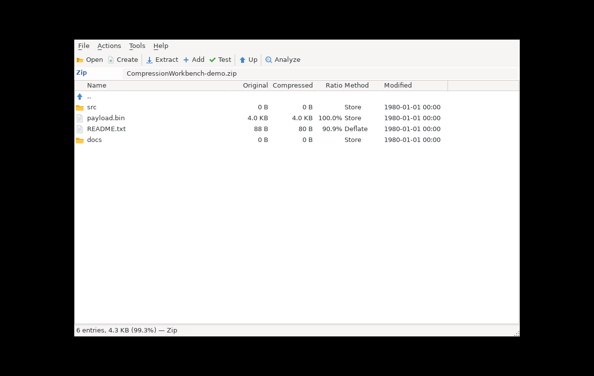

# Compression.UI

WPF archive browser and binary analysis wizard for CompressionWorkbench.

## Screenshot



Regenerated from a deterministic demo archive by `.github/workflows/generate.yml` on every push to a working branch, so a pull request never depends on a CI-only artifact. The three screenshots in the root README come from `branch-screenshots.yml` on the same trigger.

## Features

### Archive browser
- Open/extract/create/test archives
- File list with icons, columns (name, size, compressed, ratio, method, modified)
- Column sorting, breadcrumb navigation into nested folders
- Preview window with text and hex views
- Properties dialog with compression ratio visualization
- Drag-and-drop file opening, with a replace/skip prompt on name collisions
- Target options built dynamically from each format's own option metadata

### Hex viewer
- Byte-wise auto-width (adapts to window size, any column count)
- Manual override: 8, 16, 32, 64 bytes per row
- 8-byte grouping separators for readability
- Frequency-based byte coloring (in analyze mode):
  - Background: green (rare) -> neutral -> red (common)
  - Foreground: orange = control bytes, purple = high bytes

### Binary analysis wizard
Toolbar-driven analysis tools accessible via File > Analyze:

| Tool | Description |
|------|-------------|
| Scan Results | Magic bytes signature detection |
| Fingerprints | Statistical algorithm identification |
| Entropy Map | Per-region entropy with boundary detection |
| Trial Decompress | Automatic decompressor probing |
| Chain | Multi-layer compression reconstruction |
| Statistics | Full randomness/distribution analysis |
| Strings | ASCII/UTF-8/UTF-16 string extraction with search |
| Structure | Binary template parsing (`.cwbt` format) |
| Heatmap | Hierarchical heatmap explorer with a zoom stack and region extraction |

Scanning runs in either quick or deep mode.

### Maintenance
The surface behind the Maintenance menu, mirroring the `cwb` verbs of the same
names: optimize, shrink, defragment, purge and wipe, with a live block map that
bins 10³–10⁵ blocks and shows the read/write head. Double-clicking a tile opens
its contents. The verbs and what each is allowed to mean are defined in
[`docs/ARCHIVE-MODEL.md`](../docs/ARCHIVE-MODEL.md).

### Layout profiles
Editor for the layout templates that drive placement during a defragment. It
lists the built-ins shipped under `templates/` read-only alongside the user
profiles under `%APPDATA%`, and validates ranges, filters and sort keys inline.

### Partition editor
Opens a raw disk image or a virtual-disk container (VHD/VHDX/VMDK/QCOW2/VDI) and
edits its MBR/GPT table: add, delete and purge partitions, convert between
schemes, format a partition with any creatable filesystem, and verify signatures,
CRCs and extent bounds.

### Benchmark
Runs the building blocks over synthetic corpora — all-zeroes, 0xAA/0x55,
incrementing, repeating, English text, random and binary-structured — at
selectable sizes with a fixed per-test budget.

### Format reverse engineer
Wizard around `Compression.Analysis`: black-box probing of an unknown tool, or
static analysis of archives whose original content is known. Results are split
into summary, header, size fields and probe panes.

### File associations
Registers file associations and Explorer context-menu verbs, per-user (HKCU) or
for all users (HKLM, which needs elevation), with All/None/Common/Invert
quick-select.

### Statistics panel
Shared control reused in Preview, Properties, and Analysis windows:
- Randomness tests (entropy, chi-square, serial correlation, Monte Carlo pi)
- Byte distribution (unique bytes, most/least common)
- Content analysis (printable ASCII, control, high, null bytes)
- Interactive histogram with per-byte tooltips

## Building

```bash
dotnet build Compression.UI
# Requires: Windows with .NET 10 SDK (WPF)
```

## Dependencies
- `Compression.Lib` — format support
- `Compression.Analysis` — binary analysis engine
- `Compression.Mounting` — mount-neutral session contracts
- WPF + Windows Forms (for folder dialogs)

`Compression.Shell` is deliberately not referenced: the File associations window
carries its own registration code so it can offer the all-users path as well.
