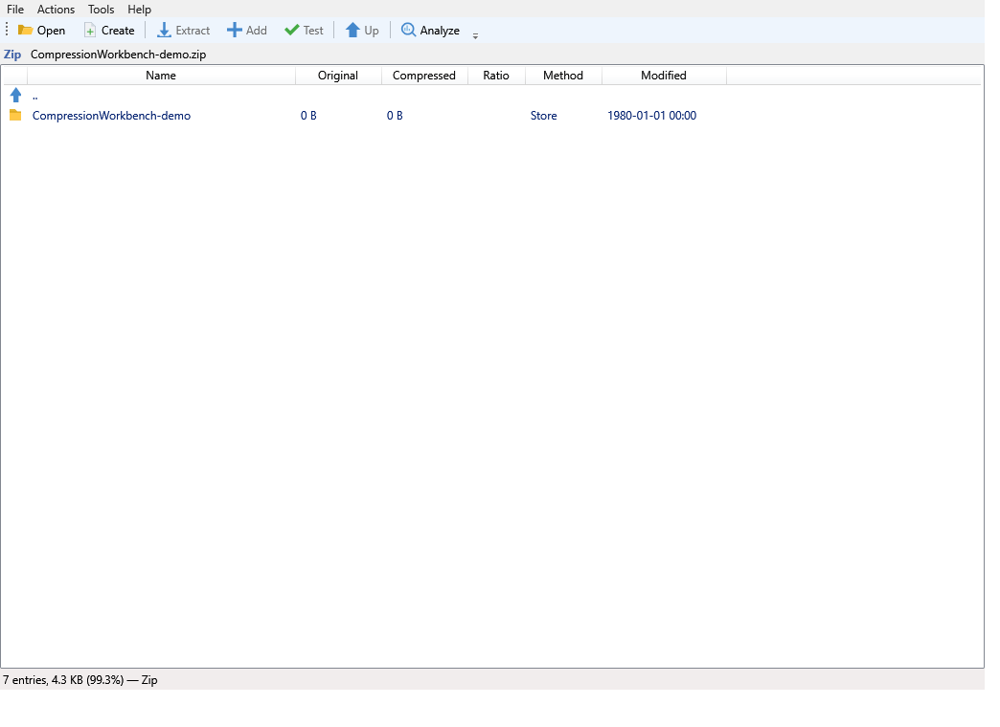
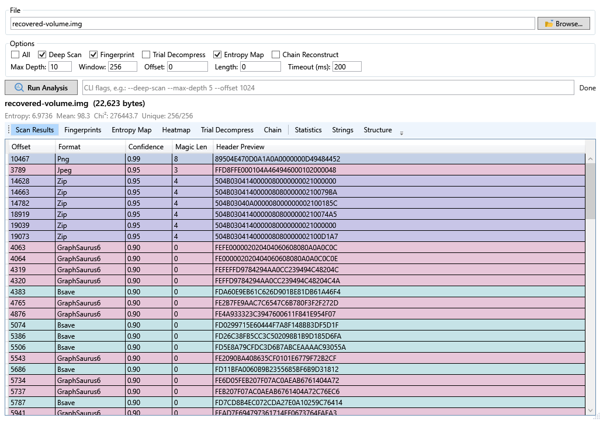
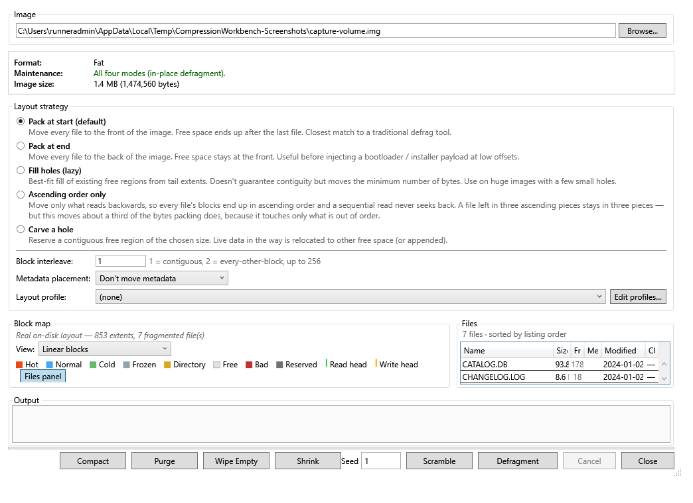

# CompressionWorkbench

[](https://github.com/Hawkynt/CompressionWorkbench/blob/main/LICENSE)
[](https://github.com/Hawkynt/CompressionWorkbench)

[](https://github.com/Hawkynt/CompressionWorkbench/actions/workflows/ci.yml)


[](https://github.com/Hawkynt/CompressionWorkbench/stargazers)
[](https://github.com/Hawkynt/CompressionWorkbench/network/members)
[](https://github.com/Hawkynt/CompressionWorkbench/issues)


[](https://github.com/Hawkynt/CompressionWorkbench/releases/latest)
[](https://github.com/Hawkynt/CompressionWorkbench/releases)
[](https://github.com/Hawkynt/CompressionWorkbench/releases)

[](https://www.nuget.org/packages/Hawkynt.Compression.Core/) [](https://www.nuget.org/packages/Hawkynt.FileFormats.Audio/) [](https://www.nuget.org/packages/Hawkynt.FileFormats.Archives/) [](https://www.nuget.org/packages/Hawkynt.FileFormats.FileSystems/) [](https://www.nuget.org/packages/Hawkynt.FileFormats.Images/) [](https://www.nuget.org/packages/Hawkynt.FileFormats.Video/)

> A pure-managed .NET toolbox for compression, format detection, conversion, container/filesystem operations, and binary analysis — with format-specific coverage documented by the package that owns each domain.

## ✨ Vision

CompressionWorkbench is built on a deliberately ambitious premise: **if you have this software, you
should not need another archiver, format inspector, or compression workbench just because the next
file happens to use a different envelope.** The long-term target is every useful compression
algorithm, archive/container, filesystem, image, audio format and video format — mainstream,
obscure, retro and awkward — supported as completely as the format itself permits.

It exists to answer two broad questions:

1. **"What is this, and what is inside?"** — given arbitrary bytes, identify the format, expose its
   native structure, recover its logical payloads, and keep descending through nested formats.
2. **"How does the algorithm work, and how does it compare?"** — provide readable managed
   implementations of compression primitives that can be inspected, benchmarked, combined and
   optimized from one codebase.

The foundation is a library of composable **compression building blocks** — dictionary coders,
entropy coders, transforms, filters and related primitives. Formats use those shared pieces instead
of each growing its own private copy. On top sits a registry-driven format ecosystem and a workbench
that can detect, inspect, convert, optimize, recurse and analyze across domain boundaries.

The vision does **not** mean pretending every format is the same thing, nor claiming unfinished work
as complete. It means:

- **Clean-room, managed implementations.** Prefer specifications, standards, published vectors and
  behavioral oracles; avoid native compression dependencies and hidden platform-specific readers.
- **Complete domain coverage as a direction, honest capability ledgers as the present truth.** A
  missing writer, unsupported profile or read-only implementation stays visible in the package that
  owns it.
- **Native semantics first.** A TIFF is an image, H.264 is a video codec, FLAC is audio, ext4 is a
  filesystem and ZIP is an archive. Each keeps the operations that actually make sense for it.
- **Addressable contents as a cross-cutting capability.** When a format naturally contains useful
  independent children — members, pages, frames, tracks, resources, partitions — the workbench can
  project them through a common traversal surface without reclassifying the format itself.
- **Analysis as a first-class surface.** Unknown or damaged data should still yield signatures,
  entropy, strings, candidate structures, carved payloads and trial decompression instead of a blunt
  "unsupported".
- **Benchmarking and optimization at the primitive level.** Compare algorithms and parameter sets on
  the actual data rather than conflating the compressor with its container overhead.
- **One engine, many surfaces.** Library APIs, `cwb`, WPF UI, shell integration, SFX and mounting
  helpers share the same registries and operations instead of becoming separate implementations.

The destination is deliberately larger than the current implementation. The package support tables
below-linked are the source of truth for what is implemented **today**; this section explains what the
project is trying to become.

---

## 🧭 Capability map

CompressionWorkbench is the orchestration and tooling layer around Hawkynt's file-format ecosystem.
This README stays at that product level; the package READMEs own the exhaustive per-format and
per-codec matrices.

| Capability | What CompressionWorkbench provides | Exact support lives in |
| --- | --- | --- |
| **Compression primitives** | Raw dictionary, entropy, transform, context-mixing and related building blocks; compress/decompress, benchmark and optimizer surfaces | [Compression.Core](Compression.Core/README.md) |
| **Compression streams and archives** | Detect, decompress/compress streams; list/extract/test containers; create and, where supported, edit existing containers; convert and run maintenance operations | [Archives](Hawkynt.FileFormats.Archives/README.md) |
| **Filesystems and disk images** | Open without relying on the host filesystem implementation; list/extract/create/edit; recurse through disk-image containers; defragment, wipe, shrink, relayout and related maintenance where implemented | [FileSystems](Hawkynt.FileFormats.FileSystems/README.md) |
| **Audio** | Codec decode/encode, audio-container handling, metadata plus track/channel/sample-oriented access where the format permits it | [Audio](Hawkynt.FileFormats.Audio/README.md) |
| **Images** | Detect, read, write, inspect metadata, convert, expose multi-image/page/frame content, and losslessly optimize supported formats | [Images](https://github.com/Hawkynt/PNGCrushCS/blob/main/Hawkynt.FileFormats.Images/README.md) |
| **Video** | Demux/mux containers, decode/encode codecs, preserve packet boundaries, and remux without needless decode/re-encode where the source and target allow it | [Video](https://github.com/Hawkynt/PNGCrushCS/blob/main/Hawkynt.FileFormats.Video/README.md) |
| **Analysis and forensics** | Signature scanning, entropy maps, statistical fingerprints, strings, trial decompression, compression-chain reconstruction, carving, structure templates and recursive extraction | `Compression.Analysis` and the `cwb analyze` / `carve` / `auto-extract` workflows |
| **Cross-format orchestration** | Common detection, nested traversal, archive/filesystem conversion, compression search, registry-driven dispatch and UI/CLI/library surfaces | [CLI](Compression.CLI/README.md), [architecture](ARCHITECTURE.md) |

The table deliberately does **not** reduce every domain to one fake universal support scale. The native
operations differ:

- archives and filesystems use **R / WORM / R/W** plus maintenance verbs;
- images expose **Read / Write / Info / Multi / Optimizer** capabilities;
- video separates **Demux / Mux** from **Decode / Encode**;
- audio tracks codec and container support separately;
- raw compression building blocks expose algorithm-level compress/decompress and parameter surfaces.

The linked package README is authoritative for those details. If a row is partial, read-only, missing
an encoder, or deliberately limited to a profile, that is documented there rather than blurred into a
root-level "supported formats" list.

---

## 🧱 Abstraction layers

CompressionWorkbench has several layers, but they have different jobs:

| Level | Responsibility | Examples |
| --- | --- | --- |
| **Building block** | Implements an algorithm independent of a file format | LZ-family matchers, Huffman/range coding, BWT/MTF, ANS/FSE |
| **Domain format/codec** | Understands the native semantics of one format | ZIP members, JPEG pixels, H.264 pictures, FLAC samples, ext4 files |
| **Addressable-entry projection** | Optionally exposes independently useful children through a common list/extract surface | archive members, image pages/frames, media tracks, resources, font members |
| **Workbench orchestration** | Detects formats, chooses operations, converts, recurses, optimizes, analyzes and combines handlers | `Compression.Lib`, `Compression.Analysis` |
| **User surface** | Presents those capabilities to people or applications | `cwb`, WPF UI, .NET APIs, shell integration, SFX/mounting helpers |

### 📂 Pseudo-archives are a projection, not a competing taxonomy

A format does not become an "archive format" merely because it contains multiple addressable things.
If a native handler can expose useful children independently, CompressionWorkbench may also project
those children through the generic archive-style `List` / `Extract` model. That lets recursive tools
walk pages, frames, tracks, resources or embedded payloads using the same traversal code.

The format still belongs to its native domain and its native package README remains the coverage
ledger. The cross-cutting contract itself is documented in [docs/ARCHIVE-MODEL.md](docs/ARCHIVE-MODEL.md).

Conceptually:

```text
bytes
  |
  +--> detect native format
         |
         +--> native API       (decode image/video/audio, open filesystem, read archive, ...)
         |
         +--> addressable view (when useful)
                 |
                 +--> enumerate/extract children
                         |
                         +--> detect again and recurse
```

This is what makes workflows such as disk image → filesystem → archive → media container → embedded
payload possible without pretending those formats are all the same kind of object.

---

## 📦 Packages

Install only the domains you need. The format ecosystem is split between this repository and the
[`Hawkynt/PNGCrushCS`](https://github.com/Hawkynt/PNGCrushCS) sibling repository.

| Package | Repository | Owns |
| --- | --- | --- |
| [`Hawkynt.Compression.Core`](Compression.Core/README.md) | CompressionWorkbench | Compression primitives and `IBuildingBlock` registry |
| [`Hawkynt.FileFormats.Audio`](Hawkynt.FileFormats.Audio/README.md) | CompressionWorkbench | Audio codecs, containers, trackers/chiptunes and game audio |
| [`Hawkynt.FileFormats.Archives`](Hawkynt.FileFormats.Archives/README.md) | CompressionWorkbench | Compression streams, archives, software/document/game/scientific containers and archive-style adapters |
| [`Hawkynt.FileFormats.FileSystems`](Hawkynt.FileFormats.FileSystems/README.md) | CompressionWorkbench | Filesystems, disk-image containers, firmware/retro disk formats |
| [`Hawkynt.FileFormats.Images`](https://github.com/Hawkynt/PNGCrushCS/blob/main/Hawkynt.FileFormats.Images/README.md) | PNGCrushCS | Image formats, image metadata, multi-image access and image optimization |
| [`Hawkynt.FileFormats.Video`](https://github.com/Hawkynt/PNGCrushCS/blob/main/Hawkynt.FileFormats.Video/README.md) | PNGCrushCS | Video containers, demux/mux, codecs, decode/encode and remux |

```bash
dotnet add package Hawkynt.Compression.Core
dotnet add package Hawkynt.FileFormats.Audio
dotnet add package Hawkynt.FileFormats.Archives
dotnet add package Hawkynt.FileFormats.FileSystems
dotnet add package Hawkynt.FileFormats.Images
dotnet add package Hawkynt.FileFormats.Video
```

All format packages are pure managed code. The CompressionWorkbench packages share the registry and
core primitives; the image/video sibling packages expose their own generated registries and shared
image model where appropriate.

---

## 🚀 Quick start

`Compression.CLI` is the general command-line surface. Representative workflows:

```bash
cwb formats                              # inspect the registered format surface
cwb analyze unknown.bin                  # signatures + entropy + trial decompression
cwb list archive.zip                     # list an addressable container
cwb extract archive.7z -o ./output       # extract
cwb create output.zip ./input            # create when the target format supports it
cwb convert input.tar.gz output.tar.xz    # convert through the cheapest valid path
cwb optimize input.zip optimized.zip     # search/re-encode for better compression
cwb auto-extract sample.vhd --recursive  # disk -> partition -> filesystem -> nested payloads
cwb carve damaged.img                    # recover recognizable files from damaged/raw data
cwb defragment disk.img --mode pack-start
```

The dedicated [Compression.CLI README](Compression.CLI/README.md) carries command-specific details,
but the root README keeps the command map below because the CLI is one of the primary ways to use the
application.

---

## ⌨️ CLI reference

`cwb` is the universal command-line surface for archive work, format conversion, optimization,
filesystem maintenance and binary analysis.

| Command | Alias | What it does |
| --- | --- | --- |
| `list <archive>` | `l` | List contents of an archive |
| `extract <archive> [files...]` | `x` | Extract files from an archive |
| `create <archive> <files...>` | `c` | Create a new archive |
| `test <archive>` | `t` | Test archive integrity |
| `add <archive> <files...>` | - | Add or replace files inside an existing archive |
| `remove <archive> <names...>` | - | Remove named entries from an existing archive |
| `replace <archive> <entry> <file>` | - | Replace a single entry with a new file |
| `info <archive>` | - | Show detailed archive information |
| `convert <input> <output>` | - | Convert between formats (archive, filesystem, stream) |
| `optimize <input> <output>` | `opt` | Re-encode with optimal compression; `--search-blocks` / `--best` searches building blocks and `--apply <out>` writes the winner |
| `bestfit <file>` | - | Benchmark building blocks, rank them and report the best compressor; `--apply <out>` writes it and `--ratio` favours best ratio within the speed window |
| `benchmark <file>` | `bench` | Benchmark all building blocks on the supplied data |
| `formats` | - | List all supported formats |
| `analyze <file>` | - | Run binary analysis (detection + entropy + trial decompress) |
| `auto-extract <file>` | - | Recursive nested extraction |
| `batch <dir>` | - | Scan a directory in parallel and aggregate format statistics |
| `suggest <file>` | - | Platform-aware format recommendation |
| `tool (init\|list\|add\|run\|remove)` | - | Manage external-tool templates |
| `reverse-engineer <tool>` | `reveng` | Black-box probing of an unknown compression tool |
| `carve <file>` | - | Photorec-style file carving at arbitrary offsets, including slack space |
| `visualize <file>` | - | Render a colored block map of detected envelopes; `--format ascii\|svg\|html` |
| `defragment <image>` | - | Defragment a filesystem image in place (`--mode pack-start\|pack-end\|fill-holes\|carve-hole`) |
| `shrink <image>` | - | Defragment + truncate trailing free space; `--compact` for sparse VHD |
| `wipe-empty <image>` | - | Zero-fill unused space, cluster tips and deleted-entry regions |
| `deploy <image> <device>` | - | Raw-write an image to a block device with CRC verification |
| `convert-clusters <image>` | - | Rebuild a FAT image with a different cluster size |
| `resize <image>` | - | Resize a filesystem image to a target size |
| `convert-archive <in> <out>` | - | Convert between any listable/creatable formats: archive↔archive, archive↔filesystem, filesystem↔filesystem; `convert-fs` is a hidden compatibility alias |
| `dedup <image>` | - | Find and optionally remove duplicate files by SHA-256 |
| `sparsify <image>` | - | Remove zero-filled blocks from a container image |
| `densify <image>` | - | Pre-allocate all blocks in a container image |

Examples:

```bash
cwb list archive.zip
cwb extract archive.7z -o ./output
cwb x archive.rar -p mypassword
cwb create output.zip myDir file1.txt '*.txt'
cwb create output.7z file.txt --method lzma2+
cwb convert input.tar.gz output.tar.xz
cwb optimize input.zip optimized.zip
cwb benchmark largefile.bin
cwb analyze unknown.bin
cwb auto-extract sample.vhd --recursive
cwb suggest big.csv
cwb defragment disk.img --mode pack-start
cwb shrink disk.img
cwb wipe-empty disk.img
cwb convert-archive disk.d64 output.zip
cwb convert-archive archive.zip out.tar
cwb convert-archive archive.zip out.img -f fat
cwb dedup disk.img --dry-run
cwb sparsify disk.vhd
cwb deploy disk.img \\.\PhysicalDrive2 --yes
```

**3-tier conversion model.** `cwb convert` picks the cheapest strategy that preserves the required
data:

| Tier | Strategy | Example |
| --- | --- | --- |
| 1 | Bitstream transfer (zero decompression) | `.gz` ↔ `.zlib`, `.zip` ↔ `.gz` |
| 2 | Container restream (decompress wrapper only) | `.tar.gz` → `.tar.xz` |
| 3 | Full recompress (extract + re-encode) | `.zip` → `.7z` |

**Method+ system.** Append `+` to a method name for its optimal encoder path, for example `deflate+`,
`lzma+` or `lz4+`.

**Tool templates.** `cwb tool` registers external CLI tools such as 7z, binwalk, file or trid in
`~/.cwb-tools.json`. Templates use `{input}`, `{output}` and `{outputDir}` placeholders and can capture
stdout, pipe stdin or set a timeout. `cwb tool init` pre-populates templates for common tools.

---

<!-- branch-screenshots:start -->
## UI snapshots

These screenshots are generated from the current branch by the real WPF application on every non-main push. They are committed back to the branch so the README shows the UI that branch actually builds, rather than a manually curated image from some older revision.

| Archive browser | Binary analysis | Maintenance |
| :--: | :--: | :--: |
| [](docs/screenshots/archive-browser.png) | [](docs/screenshots/analysis.png) | [](docs/screenshots/maintenance.png) |

<!-- branch-screenshots:end -->

## 🔬 Analysis and forensics

The analysis surfaces are intentionally useful even when no high-level format reader succeeds. They
work from the bytes outward instead of stopping at "unsupported".

### 🖥️ Compression.UI — browser, analyser and heatmap

The archive browser is the conventional half: file list with name, size, compressed size, ratio,
method and modified columns; open / extract / create / test flows; text and hex preview; properties
with compression-ratio visualization; benchmark tooling; and Explorer context-menu integration.

Power-user navigation includes:

- **`..` everywhere** — move up a folder; at archive root it exits to OS-browser mode rooted at the
  archive's containing folder.
- **Auto-descent into nested formats** — double-click an addressable child that is itself recognized
  and it opens as a nested context; `..` returns to the parent. Content-hash dedup and a depth cap
  prevent recursive loops.
- **Drag in / drag out** — drop files on the window to open or add them; drag entries out to Explorer
  or another drop target.
- **Last-folder restore** — relaunching returns to the last usable folder, walking upward if that path
  disappeared.
- **Registered file-type filters** — the Open dialog exposes an all-formats filter plus generated
  per-format filters.

The Binary Analysis wizard walks progressively deeper through an unknown binary:

- **Scan Results** — registered magic-byte signatures with offsets and confidence.
- **Fingerprints** — likely compression algorithms from byte and byte-pair statistics.
- **Entropy Map** — per-region entropy with change-point and edge detection to expose boundaries.
- **Trial Decompress** — registered stream decompressors run in parallel with timeout and plausible-
  output early termination.
- **Chain** — recursive reconstruction of layered compression such as `gzip(bzip2(data))`.
- **Statistics** — byte distribution, bigrams, chi-square randomness, longest run and run lengths.
- **Strings** — ASCII / UTF-8 / UTF-16 search with regex support.
- **Structure** — ImHex/010-style `.cwbt` templates; built-ins include ZIP, PNG, BMP, ELF and Gzip,
  with integer/float endian variants, arrays, BCD, fixed-point, color, date/time and network types.

### 🗺️ Heatmap Explorer

The Heatmap Explorer is the visual first pass. A 16×16 colour grid represents a proportional region
of the file; each of the 256 cells is one tile.

| Cell colour | Meaning | Entropy |
| --- | --- | --- |
| Blue | Low entropy — zeros, padding, simple headers | 0.0–3.0 |
| Green | Structured data — tables, records, text | 3.0–5.5 |
| Orange | Compressed data | 5.5–7.5 |
| Red | Random / encrypted (incompressible) | 7.5–8.0 |
| Purple | A known format signature was detected here | any |

Click a cell to subdivide it into another 16×16 grid and recursively zoom into that region. Hovering
shows offset, size, entropy, unique-byte count and a detected signature when present. **Extract** on a
purple cell saves just that region. The explorer samples each block rather than loading the whole file,
so it remains usable on very large inputs. It is available from the analyser's **Heatmap** tab.

### 🧬 Compression.Analysis — analyser as a library

Everything behind the UI is also available from the managed `Compression.Analysis` library:

- **Signature Scanner** — magic-byte detection for every registered format using a hash-indexed scan.
- **Algorithm Fingerprinting** — statistical matching against known compression-output distributions.
- **Trial Decompression** — `TryAllAsync` runs registered stream decompressors in parallel with
  per-trial timeout and early termination.
- **Chain Reconstruction** — discovers layered compression.
- **Entropy Mapping** — per-region profiling, multi-resolution entropy pyramids, CUSUM binary
  segmentation, KL-divergence / chi-square validation and edge sharpening.
- **String Extraction** — ASCII / UTF-8 / UTF-16 with regex.
- **Structure Templates** — `.cwbt` template language.
- **Streaming Analysis** — reads a small header window and computes entropy chunk-by-chunk for inputs
  that should not be materialized in memory.
- **Black-box tool integration** — `ExternalToolRunner`, `ToolOutputParser`, `CrossValidator` and
  `FallbackDecompressor` with tool discovery on `PATH`.
- **AutoExtractor** — recursive nested extraction across archives, disk images, partition tables,
  filesystems and contained files, with configurable depth and file-size limits.
- **BatchAnalyzer** — parallel directory scanning with aggregate format statistics.
- **FileCarver / FileCarverOutputSink** — streaming magic-scan carving for damaged dumps.
- **FilesystemCarver / FilesystemExtractor** — locate filesystem superblocks inside a stream, validate
  candidates with their native readers and extract per-file with isolated error handling.
- **RecursiveFilesystemCarver** — descend wrapper chains such as VHD → MBR → FAT → ZIP while retaining
  each hit's `EnvelopeStack` lineage.
- **BlockMap / BlockMapRenderer** — ASCII / SVG / HTML visualization of nested envelope stacks; used by
  `cwb visualize`.
- **PayloadCarver, StringsExtractor, EntropyHeatmap** — standalone analysis helpers.

**Detection pipeline.** Magic bytes → parallel trial decompression with plausible-output early
termination → extension fallback → deep probe with header parse, structural validation and integrity
checks.

**Partition-table support.** `MbrParser`, `GptParser` and `PartitionTypeDatabase` feed recursive
descent so `--recursive` can follow disk image → partition table → filesystem → nested format.

Analysis does not change format ownership: discovering JPEG data inside damaged storage does not make
JPEG an archive format, and finding an ext superblock does not make `Compression.Analysis` the ext
implementation. Once a native handler exists, analysis delegates to the owning package.

---

## 🛠️ Optimization, conversion and maintenance

Three cross-cutting ideas are worth knowing at root level because they combine several packages:

### 🗜️ Compression search

Building blocks expose their tunable parameters instead of collapsing to a single "fast" or "best"
preset. `benchmark`, `bestfit` and `optimize` can compare algorithms and parameter sets on the actual
input data. Algorithm details and input-size constraints live in
[Compression.Core/README.md](Compression.Core/README.md) and [docs/LARGE-INPUTS.md](docs/LARGE-INPUTS.md).

### 🔄 Conversion

Conversion chooses the cheapest valid path that preserves the required data. Depending on source and
target, that can mean transferring an existing bitstream, restreaming a container, or fully decoding
and re-encoding. Container/filesystem conversion is gated by the capabilities of both ends rather
than by hard-coded format pairs.

### 🧹 Maintenance

Archives, filesystems and disk-image containers can expose maintenance verbs such as defragment,
shrink, wipe, layout/optimize or reorder. Those are capabilities, not promises made for every format.
The authoritative per-format cells are in the [archive](Hawkynt.FileFormats.Archives/README.md) and
[filesystem](Hawkynt.FileFormats.FileSystems/README.md) matrices; the common mechanisms are described
in [docs/MAINTENANCE-MECHANISMS.md](docs/MAINTENANCE-MECHANISMS.md).

---

## 🏗️ Architecture

The repository separates algorithms, registries, format packages and presentation surfaces rather
than making every project know every format:

```text
Compression.Core
      |
Compression.Registry <--- source-generated descriptor registration
      |
Compression.Lib -------> common detection / operations / conversion
      |
      +--> Compression.Analysis
      +--> Compression.CLI
      +--> Compression.UI
      +--> Compression.Shell / Compression.Sfx.* / Compression.Mounting.*
      |
      +--> Hawkynt.FileFormats.Audio
      +--> Hawkynt.FileFormats.Archives
      +--> Hawkynt.FileFormats.FileSystems
```

Image and video packages live in the sibling PNGCrushCS repository and integrate at their package
boundaries instead of being duplicated here.

See [ARCHITECTURE.md](ARCHITECTURE.md) for project-level dependencies and
[CONTRIBUTING.md](CONTRIBUTING.md) for registry, format-project and testing conventions.

---

## 🧪 Building and testing

```bash
dotnet build CompressionWorkbench.slnx
dotnet test
```

The WPF UI targets Windows. On Linux, `run-wine.sh` builds and launches the self-contained Windows UI
under Wine.

---

## 📚 Documentation

| Question | Go here |
| --- | --- |
| Which compression algorithms exist and what are their limits? | [Compression.Core/README.md](Compression.Core/README.md), [docs/LARGE-INPUTS.md](docs/LARGE-INPUTS.md) |
| Which archive/stream formats can be read, created or edited? | [Hawkynt.FileFormats.Archives/README.md](Hawkynt.FileFormats.Archives/README.md) |
| Which filesystems/disk images support R, WORM, R/W and maintenance? | [Hawkynt.FileFormats.FileSystems/README.md](Hawkynt.FileFormats.FileSystems/README.md) |
| Which audio codecs/containers decode or encode? | [Hawkynt.FileFormats.Audio/README.md](Hawkynt.FileFormats.Audio/README.md) |
| Which image formats read/write/info/multi/optimize? | [Hawkynt.FileFormats.Images/README.md](https://github.com/Hawkynt/PNGCrushCS/blob/main/Hawkynt.FileFormats.Images/README.md) |
| Which video containers/codecs demux/mux/decode/encode? | [Hawkynt.FileFormats.Video/README.md](https://github.com/Hawkynt/PNGCrushCS/blob/main/Hawkynt.FileFormats.Video/README.md) |
| How are media-container, audio-codec and video-codec ledgers separated? | [docs/MEDIA-LEDGERS.md](docs/MEDIA-LEDGERS.md) |
| What CLI commands exist? | [Compression.CLI/README.md](Compression.CLI/README.md) and [CLI reference](#%EF%B8%8F-cli-reference) |
| What does the common archive/addressable-entry model mean? | [docs/ARCHIVE-MODEL.md](docs/ARCHIVE-MODEL.md) |
| How do maintenance operations work without per-format duplication? | [docs/MAINTENANCE-MECHANISMS.md](docs/MAINTENANCE-MECHANISMS.md) |
| How is the solution structured? | [ARCHITECTURE.md](ARCHITECTURE.md) |
| How do I add or change a format? | [CONTRIBUTING.md](CONTRIBUTING.md) |

---

## 📖 References to learn from

These remain useful both as implementation references and as places to learn the formats and
compression families CompressionWorkbench deals with:

- **RFCs:** [RFC 1951](https://www.rfc-editor.org/rfc/rfc1951) (Deflate), [RFC 1952](https://www.rfc-editor.org/rfc/rfc1952) (Gzip), [RFC 1950](https://www.rfc-editor.org/rfc/rfc1950) (Zlib), [RFC 7932](https://www.rfc-editor.org/rfc/rfc7932) (Brotli), [RFC 8878](https://www.rfc-editor.org/rfc/rfc8878) (Zstandard)
- **[libxad](https://github.com/ashang/libxad)** — archive decompressor and format reference
- **[XADMaster / The Unarchiver](https://github.com/MacPaw/XADMaster)** — modern continuation of libxad
- **[libarchive](https://github.com/libarchive/libarchive)** — multi-format archive reference
- **[Wikipedia list of archive formats](https://en.wikipedia.org/wiki/List_of_archive_formats)**
- **[ArchiveTeam — Just Solve The File Format Problem](http://fileformats.archiveteam.org/wiki/Compression)** — compression-format documentation
- **[7-Zip](https://github.com/ip7z/7zip)** — multi-archiver reference implementation
- **[Matt Mahoney's data-compression page](https://mattmahoney.net/dc/)** — context-mixing compressors and corpora
- **[Packing Box](https://github.com/packing-box/awesome-executable-packing)** — curated executable-packer material

---

## ❤️ Support

If this project saves you time or money, consider supporting its development:

[](https://github.com/sponsors/Hawkynt)
[](https://www.paypal.me/hawkynt)

## 📜 License

Licensed under LGPL-3.0-or-later — see [LICENSE](LICENSE).
